## 收图浏览

<div align="left">

## Features

### 1、媒体保护

1.1 如果你不想对方乱滑看到你不想让他看的图片，可以使用展示模式。

操作步骤：

1. 选中图片

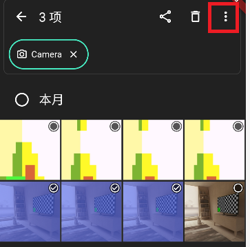

2. 点击右上角红框加入展示
 
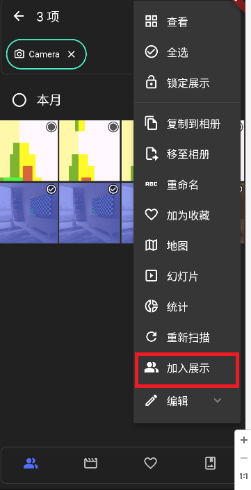

3. 锁定展示
 


4. 这样，除了已加入展示的内容，相册将不会显示任何其它内容。
 


5. 解锁密码默认为1234，可在设置中修改


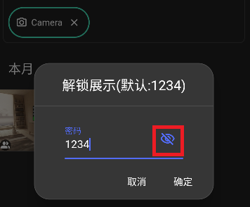


6. 忘记密码，清空软件数据或卸载APP重装：
 
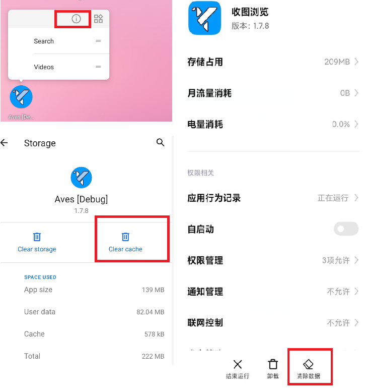

7.“验证展示”“取消展示”，与锁定解锁效果一样，但不需要输入密码。
 


1.2  图片展示标签设置

1.2.1 默认每次加入展示标签会清空之前标签的的可见性，并生成一个新的时间标签。
 
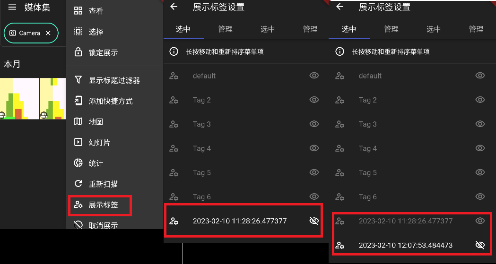

1.2.2 选择不同的标签可以显示不同的媒体文件。同一个媒体文件可以同时加入多个标签。

1.2.3 取消所有显示无效，必须选择至少一个标签。
 
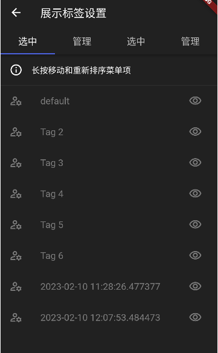
展示标签长按与移动重新排序也是无效的。

1.2.4 在“管理”中，可以重命名展示标签（左侧红框）或删除展示标签（右侧红框）。
删除标签后，除非被其他标签包含，该标签代表的媒体文件将不会在展示模式中显示。
Tag 2-6 是程序自动生成的样例标签，您可以随意删除，但是不提供删除default标签。
 


1.2.5 可以在设置中选择将新增媒体文件自动添加到当前可见标签中。
 


1.2.6 展示标签与媒体标签不同，展示标签仅保存在此APP内，删除APP会永久删除。媒体标签保存在文件中，不会因删除APP而丢失。
点开任意一个图片/视频上滑）
 


1.2.7 Bug：如果媒体文件有标签但标签页没有显示，请在相应目录中重新扫描编目。注意：文件数量较多的目录可能重新扫描仍然无效。如果要正常使用标签页和国家页，请下载APP：Aves。
 


###  2、对相册使用展示模式
2.1. 在相册界面将整个目录加入展示
 

 
2.2. 重命名该目录
 
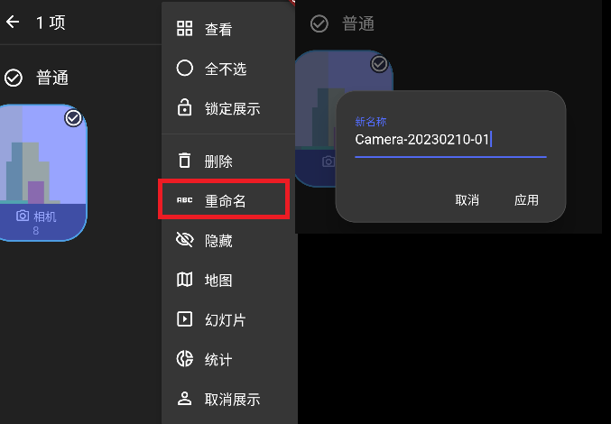

2.3. 验证展示，确保不会显示重命名的文件夹
 


2.4. 切出APP，拍摄新照片并确认自动在展示模式下显示
可能短时间不会被刷新出来，需要等待一点时间。 

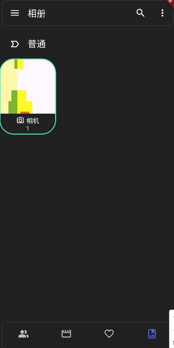

2.5. 在展示标签设置中管理展示的标签
 


*****
**注意：展示隐藏仅在此APP内生效，使用其他软件可以看到全部媒体文件**
**可以将其他看图软件添加应用锁，仅使用此软件给别人看图**
*****

### 3、设置桌面壁纸
小米画报缺点：
```
1. 上限500张图片
2. 更新频率受限制
3. 复制图片浪费存储空间
```

3.1 设置桌面壁纸

3.1.1 在桌面空白处长按，选择“添加工具”，找到软件工具，拖放到桌面：
 


3.1.2 弹出设置窗口，设置成“仅桌面”（bug:MIUI设置锁屏无效）：
 


3.1.4 点击编辑图标（上图最小红框）进入相册，选择图片集：
 


3.1.5 可以按关键字搜索并设置设置图片集。
以手机pixiv 为例，其保存文件名一般以“illust_”开头，输入“ill” 回车确认；
长按视频标签，点击滤除，点击纵向，最终显示出所有包含ill字段，纵向的图片：
 


3.1.6 点击保存，桌面生成图片微件。长按可以调整微件位置和大小。点击将进入查看器，且强制更新壁纸。

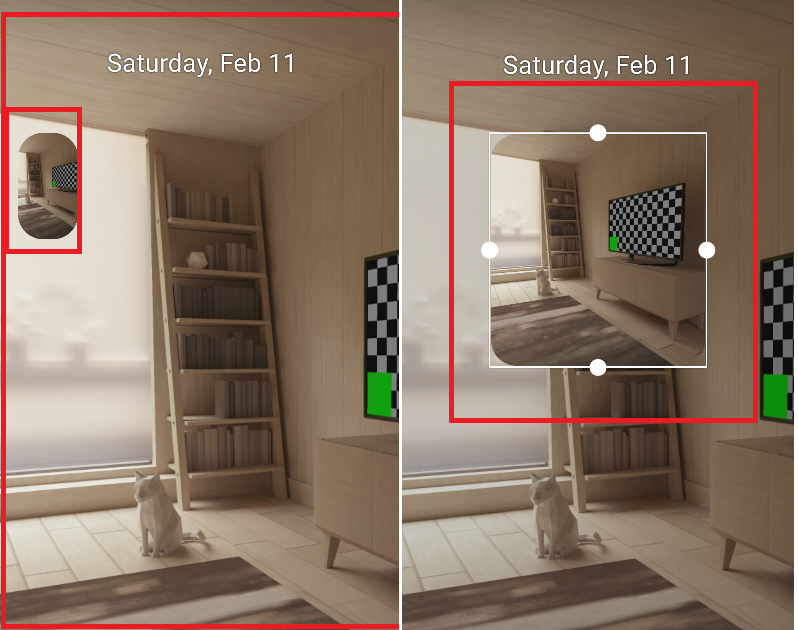

3.1.7 在原生Android中，可以直接更新微件设置，MIUI需要在设置界面重新设置
 
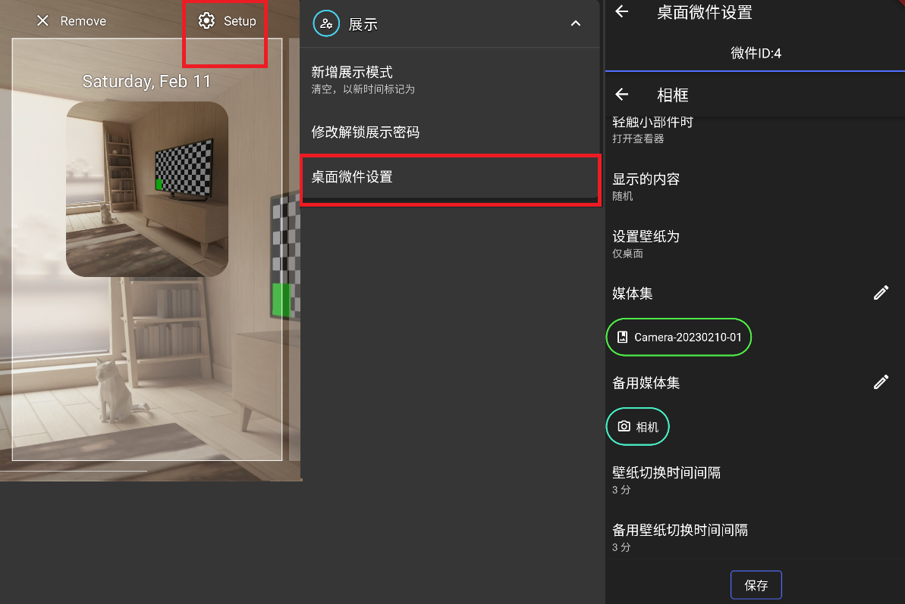


3.1.8 备用媒体集稍后讲。更换间隔默认3分钟，有效设置范围是1秒到47小时59分59秒。
> alarmManager.setInexactRepeating(AlarmManager.ELAPSED_REALTIME, SystemClock.elapsedRealtime() + internal, internal.toLong(), pendingIntent)
setInexactRepeating 更新时间不会精确，设置成3秒实际等待可能3~15s，取决于手机的运行状态。
见：
 
[https://developer.android.com/reference/android/app/AlarmManager](https://developer.android.com/reference/android/app/AlarmManager)


3.2 缓解壁纸社会性死亡问题

3.2.1 在相册、缩略图或查看器中找到"微件备用切换"按钮。
 


3.2.2 点击按钮切换所有微件的媒体集和备用媒体集，以及更新间隔和备用更新间隔的设置。立即更新每个微件一次。
 


3.2.3 设计目的是独处时使用一种壁纸设置，外出公开场合使用另一种，以缓解壁纸社会性死亡。

3.2.4 无bug时，可以直接点击桌面微件进入图片查看器切换设置。如果有bug，请打开APP找到微件备用切换。


3.3 已知问题

bug1: 在系统出现问题（如微件添加失败）时，桌面微件可能会显示已经不存在的微件的设置。重新安装APP可以解决此问题。不重装不影响设置正常微件。
正常：
 

 
bug：
 


bug2: 偶尔会出现桌面微件无法显示图像，点击进入微件让它强制更新即可，或等待下一次自动更新。

bug3: 偶尔微件会停止更新，点击进入让它强制更新即可。

3.4 注意事项

**请不要添加太多更新频率较快的微件，以免造成手机卡顿。
不要同时添加太多设置桌面壁纸的微件，以免造成手机卡顿。
图片中的设置并不代表实际使用中的设置，请根据个人情况进行设置。**
目前（20230213），我的设置有两个微件：
1. 设置桌面壁纸，每1分钟更新一次。
 2. 不设置桌面壁纸，每10秒更新一次。

### 4 、对Aves的小改动
4.1 编辑功能修改

我对Aves中的编辑功能进行了修改。
原来Aves不支持对媒体文件进行编辑，只是调用手机上已安装的其他应用。这会直接覆盖原文件，导致数据损失。
为了避免这种情况，我修改了编辑功能，使其自动复制文件，对复制后的文件进行编辑。但是，取消编辑后，复制的文件不会自动删除。

4.2 取消显示全部媒体集

原Aves中，取消标签显示功能会显示所有媒体文件。由于我有大量图片，因此不喜欢这个功能。
因此，我对该功能进行了修改，可以在设置界面开启此功能。
 
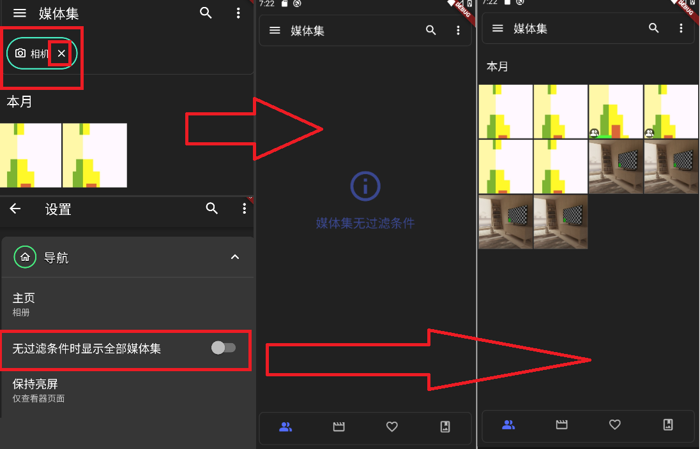

4.3 其他小修小改，不再详细阐述。

### 获取收图浏览APP方法
Github：
[https://github.com/t4y-123/ac_viewer/releases/tag/publish-play](https://github.com/t4y-123/ac_viewer/releases/tag/publish-play)
OneDriver：
[https://1drv.ms/u/s!Akj4Qncyo3Oxcq1skIIq4uDa620?e=sd2mc1](https://1drv.ms/u/s!Akj4Qncyo3Oxcq1skIIq4uDa620?e=sd2mc1)
MD5值：
`09CFF3F2FA6CE2937CD8EFE23A25AEA0`
*****
使用电脑，在apk所在文件夹地址栏输入: **powershell**


输入命令：
>  Get-FileHash  ./*  -Algorithm MD5

得到MD5值
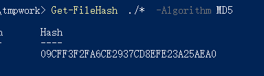

****
## 收图浏览介绍
这个应用程序是完全基于 Github 开源应用程序 Aves 的修改版本。我一直使用的是快图浏览 4.7.2.2421 版本，因此取名为收图浏览，并以快图浏览的风格修改图标。我将尝试通过邮件联系 Aves 开发者 Thibault Deckers。如果原作者将我修改的代码整合到 Aves 项目中，那么这个应用程序实际上也不再需要使用了。

我有一些改进的想法，但是暂时不打算开发。

例如，对于展示模式的改进：

将相册也设置为一个标签对应多个相册，一个相册可以出现在多个标签，以实现多层相册目录浏览。
例如私人场景、生活场景、工作场景等不同场景的相册。
将“展示的切换与加锁”替换为“场景的切换与加锁”。
APP应该能自动标注新添加的图片所属场景，例如在生活场景下拍摄的照片，不需要手动加入，也能在切换到其他场景时不可见。

因为其他人能力更强，可以比较快地开发出更好的功能，所以由我开发可能浪费双方时间。
我应该多去阅读官方开发文档和其他开源项目，之后再回来修改APP。因此，该APP可能不会在短期内进行更新维护。


## 原Aves的一些Feature
1、
可以根据条件进行媒体内容搜索，如年份、月份、天数、图片长宽、文件大小KB、MB、GB等。
代码如下：\lib\model\filters\query.dart
>   static final _fieldPattern = RegExp(r'(.+)([=<>])(.+)');
 >  static final _fileSizePattern = RegExp(r'(\d+)([KMG])?');
 >  static const keyContentId = 'ID'; // 精确匹配ID，一般用不上。
 >  static const keyContentYear = 'YEAR';
 >  static const keyContentMonth = 'MONTH';
 >  static const keyContentDay = 'DAY';
 >  static const keyContentWidth = 'WIDTH';
 >  static const keyContentHeight = 'HEIGHT';
 >  static const keyContentSize = 'SIZE';
 >  static const opEqual = '=';
 >  static const opLower = '<';
 >  static const opGreater = '>';

如下图，大于２ＭＢ，小于４ＭＢ，晚于2012年的图片。
 
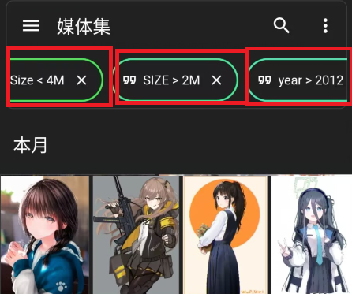

2、
可以使用两指缩放界面网格大小。

3、
长按图片可以选中，长按并滑动手指可以多选。

4、
地图功能，中国版本比国外版本少三种地图。
下为我从github上下载的国内华为应用商店的Aves：

[https://1drv.ms/u/s!Akj4Qncyo3Oxd8rhWFRdzwXZ20I?e=3IR3bL](https://1drv.ms/u/s!Akj4Qncyo3Oxd8rhWFRdzwXZ20I?e=3IR3bL)

> C6DC9DD85D41532611D416C4B089721C

5、
当媒体文件达到数十万份，总容量约为100~200G时，APP将崩溃退出。
因此，Aves仅适用于图片和视频不是很多的用户，约为几万到十几万张。

*****
#  **原 Aves 软件的github介绍**

<div align="center">


## Aves

![Version badge][Version badge]
![Build badge][Build badge]

Aves is a gallery and metadata explorer app. It is built for Android, with Flutter.

[](https://play.google.com/store/apps/details?id=anonymity.ac.viewer&pcampaignid=pcampaignidMKT-Other-global-all-co-prtnr-py-PartBadge-Mar2515-1)
[](https://appgallery.huawei.com/app/C106014023)
[](https://galaxy.store/aves)
[](https://www.amazon.com/dp/B09XQHQQ72)
[](https://apt.izzysoft.de/fdroid/index/apk/anonymity.ac.viewer)
[](https://f-droid.org/packages/anonymity.ac.viewer.libre)
[](https://github.com/deckerst/aves/releases/latest)


[Compare versions](https://github.com/deckerst/aves/wiki/App-Versions)
      
<div align="left">

## Features


It scans your media collection to identify **motion photos**, **panoramas** (aka photo spheres), **360° videos**, as well as **GeoTIFF** files.

**Navigation and search** is an important part of Aves. The goal is for users to easily flow from albums to photos to tags to maps, etc.

Aves integrates with Android (from **API 19 to 33**, i.e. from KitKat to Android 13) with features such as **widgets**, **app shortcuts**, **screen saver** and **global search** handling. It also works as a **media viewer and picker**.

## Screenshots

<div align="center">

[](https://raw.githubusercontent.com/deckerst/aves_extra/main/screenshots/play/en/1.png)
[](https://raw.githubusercontent.com/deckerst/aves_extra/main/screenshots/play/en/2.png)
[](https://raw.githubusercontent.com/deckerst/aves_extra/main/screenshots/play/en/5.png)
[](https://raw.githubusercontent.com/deckerst/aves_extra/main/screenshots/play/en/3.png)
[](https://raw.githubusercontent.com/deckerst/aves_extra/main/screenshots/play/en/4.png)
[](https://raw.githubusercontent.com/deckerst/aves_extra/main/screenshots/play/en/6.png)

<div align="left">

## Changelog

The list of changes for past and future releases is available [here](https://github.com/deckerst/aves/blob/develop/CHANGELOG.md).

## Permissions

Aves requires a few permissions to do its job:
- **read contents of shared storage**: the app only accesses media files, and modifying them requires explicit access grants from the user,
- **read locations from media collection**: necessary to display the media coordinates, and to group them by country (via reverse geocoding),
- **have network access**: necessary for the map view, and most likely for precise reverse geocoding too,
- **view network connections**: checking for connection states allows Aves to gracefully degrade features that depend on internet.

## Contributing

### Issues

[Bug reports](https://github.com/deckerst/aves/issues/new?assignees=&labels=type%3Abug&template=bug_report.md&title=) and [feature requests](https://github.com/deckerst/aves/issues/new?assignees=&labels=type%3Afeature&template=feature_request.md&title=) are welcome, but read the [guidelines](https://github.com/deckerst/aves/issues/234) first. If you have questions, check out the [discussions](https://github.com/deckerst/aves/discussions).

### Code

At this stage this project does *not* accept PRs.

### Translations

Translations are powered by [Weblate](https://hosted.weblate.org/engage/aves/) and the effort of wonderfully generous volunteers.
<a href="https://hosted.weblate.org/engage/aves/">

</a>

If you want to translate this app in your language and share the result, [there is a guide](https://github.com/deckerst/aves/wiki/Contributing-to-Translations).

### Donations

****
此处内容本来是赞助支付信息。
如果您想支持Aves的开发，请前往Thibault Deckers的GitHub进行转账。
尽管我只是做了一些微不足道的修补工作，但我认为让别人从我这里转账，多少有点不合适。
我不认识他，也不会因为有人从我这里转账而分到一点钱。
****

## Project Setup

Before running or building the app, update the dependencies for the desired flavor:
```
# scripts/apply_flavor_play.sh
```

To build the project, create a file named `<app dir>/android/key.properties`. It should contain a reference to a keystore for app signing, and other necessary credentials. See [key_template.properties](https://github.com/deckerst/aves/blob/develop/android/key_template.properties) for the expected keys.

To run the app:
```
# ./flutterw run -t lib/main_play.dart --flavor play
```

[Version badge]: https://img.shields.io/github/v/release/deckerst/aves?include_prereleases&sort=semver
[Build badge]: https://img.shields.io/github/actions/workflow/status/deckerst/aves/check.yml?branch=develop
=======

