AC Viewer

## Features
###  1. Media protection
1.1 If you don't want others to casually swipe through pictures you don't want them to see, you can use the presentation mode.

Steps:

1.1.1 Select the picture
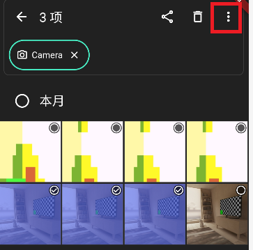

1.1.2 Click on the red box in the top right corner to add to presentation
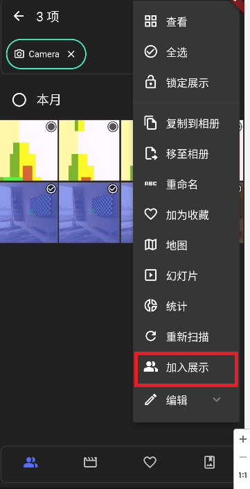


1.1.3 Lock the presentation
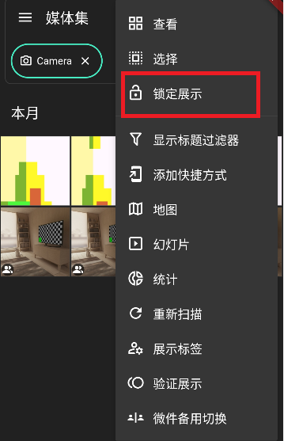

1.1.4 This way, except for the content that has been added to the presentation, the album will not display any other content.
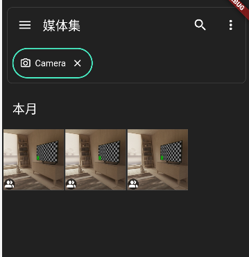

1.1.5 The unlock password is 1234 by default, and can be changed in settings.

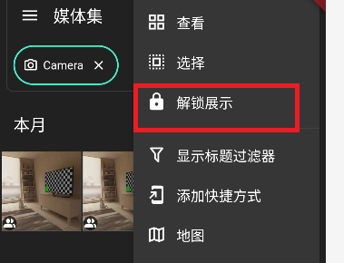

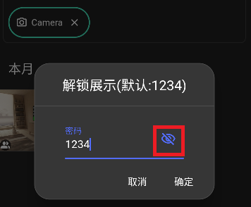

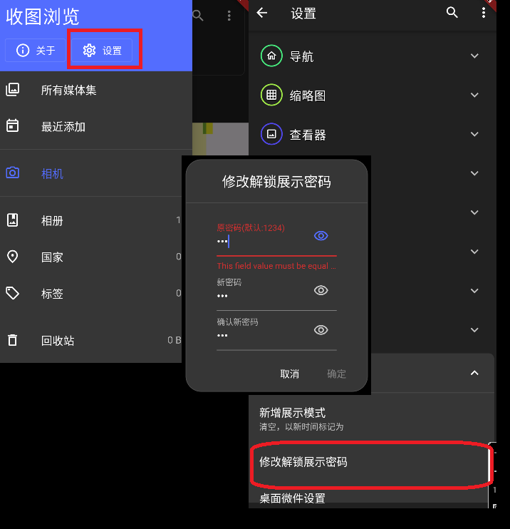

1.1.6 If you forget the password, clear the software data or uninstall the APP and reinstall it:
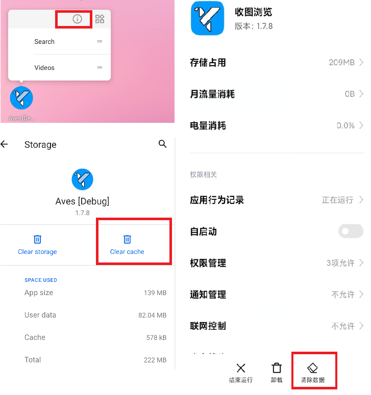

1.1.7 "Verify presentation" and "Cancel presentation" have the same effect as locking and unlocking, but without entering a password.
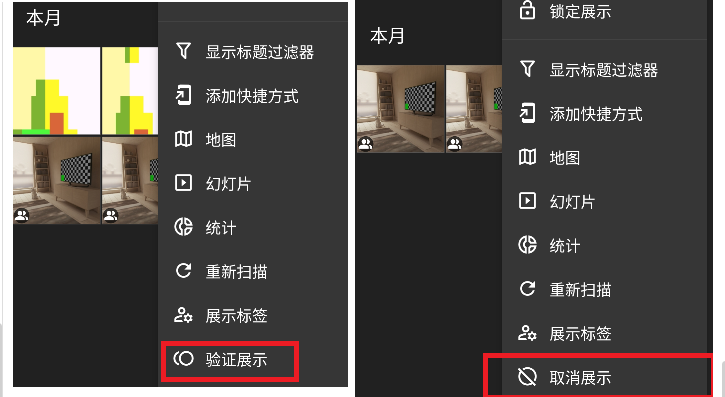


1.2 Display Tag Settings

1.2.1 By default, adding a display tag will clear the visibility of previous tags and create a new timestamp tag.

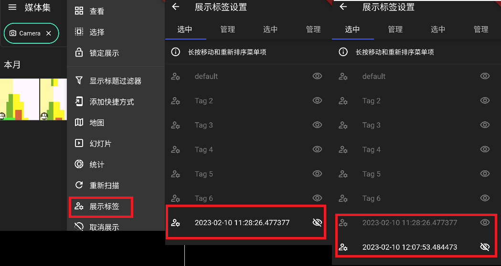

1.2.2 Selecting different tags can display different media files. The same media file can be added to multiple tags at the same time.

1.2.3 Cancelling all displays is invalid, and at least one tag must be selected.
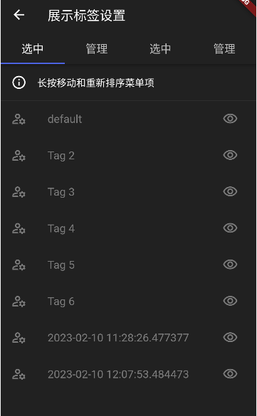
Long pressing and moving to reorder display tags  also have no effect.

1.2.4 In "Management", you can rename the display tag (left red box) or delete the display tag (right red box).
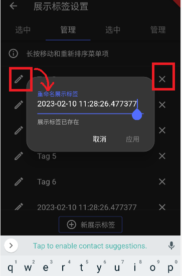
After a tag is deleted, the media file represented by the tag will not be displayed in the display mode unless contained by other tags. Tag 2-6 is an automatically generated sample tag, you can delete it at will, but deletion of the default tag is not provided.


1.2.5 You can select to automatically add newly added media files to the current visible tags in the settings.
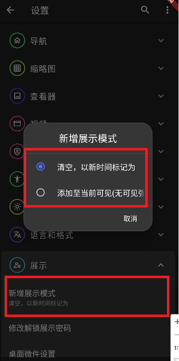

1.2.6 The display tag is different from the media tag, the display tag is only saved within this APP, and deletion of the APP will permanently delete it. The media tag is saved in the file and will not be lost due to deletion of the APP.
(Slide down on any image/video)
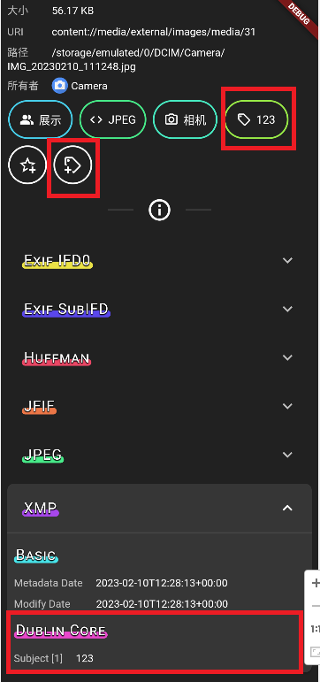

1.2.7 Bug: If the media file has a tag but the tag page is not displayed, please rescan the catalog in the corresponding directory. Note: Directories with a large number of files may still be ineffective after rescanning. If you want to use the tag page and country page normally, please download the APP: Aves.
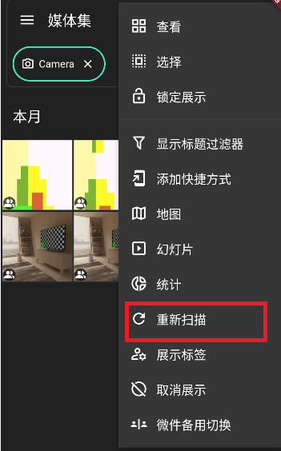


###  2. Using Display Mode In Album Page
2.1. Add the entire directory to the display in the album interface
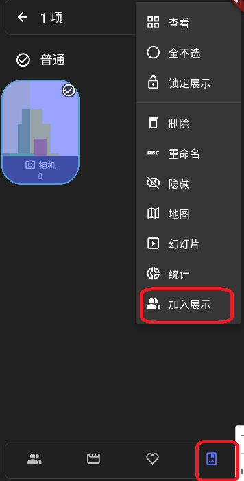
2.2. Rename the directory
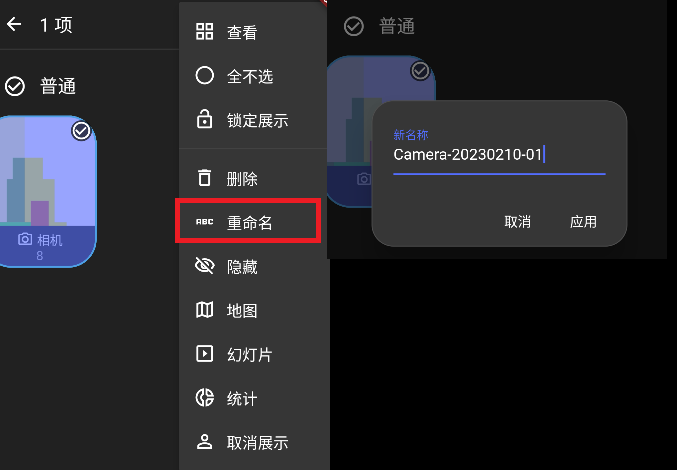

2.3. Verify the display to make sure the renamed folder is not displayed
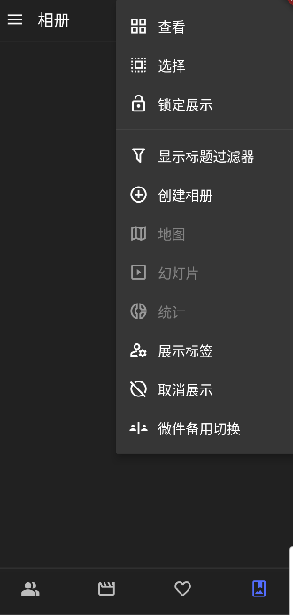

2.4. Exit the app, take a new photo, and confirm it is automatically displayed in display mode
It may not be refreshed immediately and may take a little time.
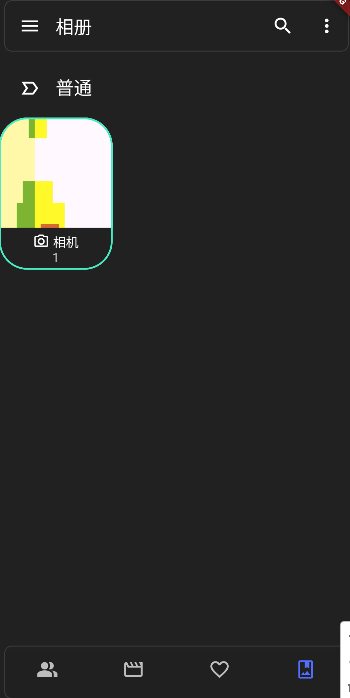

2.5. Manage the display tags in the display tag settings
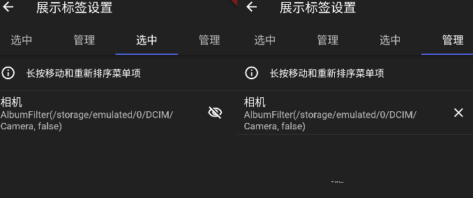

*****
**Note: Display hiding is only effective within this app. Using other software, you can see all media files
You can add an app lock to other picture viewing software and only use this software to show pictures to others**
*****

###  3.1 Setting Desktop Wallpaper

3.1.1 Long press on the desktop blank to select "Add Tool", find the software tool and drag it to the desktop:
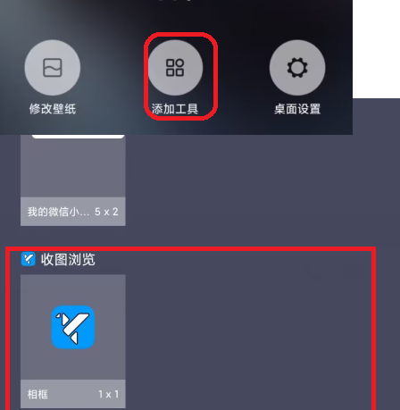

3.1.2 Pop up the setting window, set it to "Only Desktop" (bug: MIUI set lock screen is invalid):
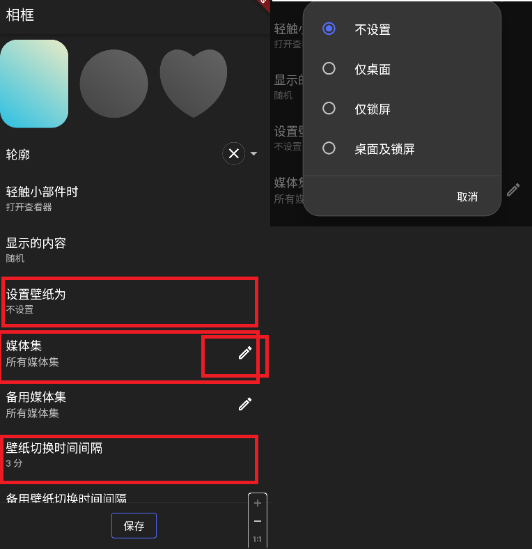

3.1.4 Click the edit icon (the smallest red box in the above figure) to enter the album, select the image set:
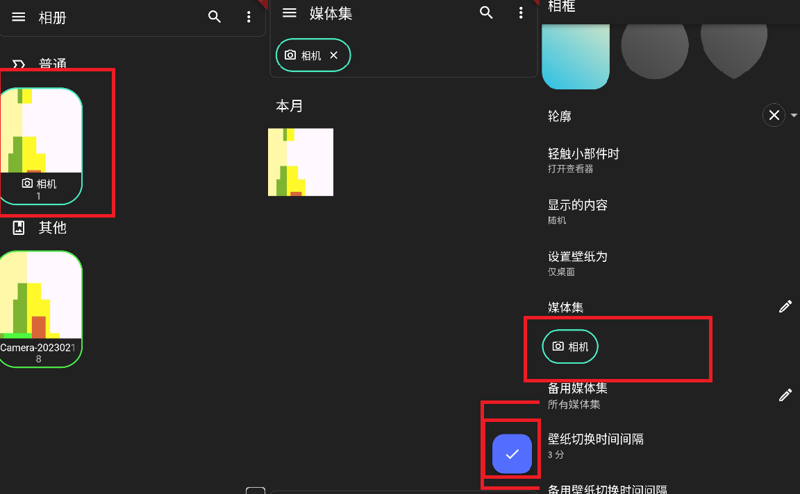

3.1.5 You can search by keyword and set the image set.
Taking the mobile pixiv as an example, its saved file name generally starts with "illust_", enter "ill" and press Enter to confirm;
Long press the video tag, click filter, click vertical, finally display all images that contain the ill field, vertical:
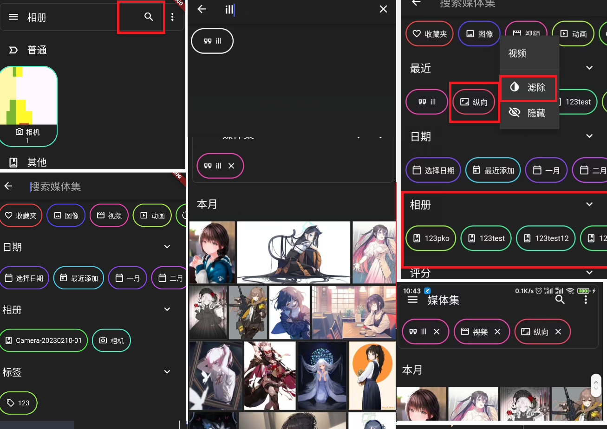

3.1.6 Click Save, the desktop generates an image widget. Long press to adjust the widget position and size. Clicking will enter the viewer and force an update to the widget.

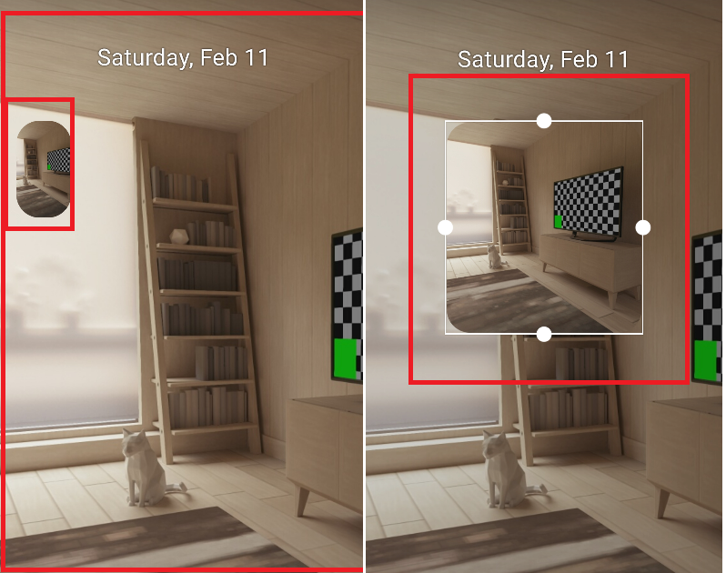

3.1.7 In native Android, you can directly update the widget settings, MIUI needs to reset the settings in the setting interface.
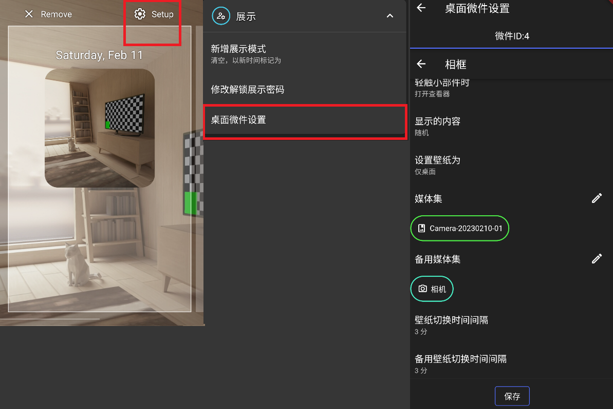

3.1.8 The backup media set will be discussed later. The default update interval is 3 minutes, and the effective setting range is 1 second to 47 hours 59 minutes 59 seconds.

> alarmManager.setInexactRepeating(AlarmManager.ELAPSED_REALTIME, > > SystemClock.elapsedRealtime() + internal, internal.toLong(), pendingIntent)

`setInexactRepeating` update time is not accurate, setting to 3 seconds, the actual wait may be 3~15s, depending on the running state of the phone.
See:
[https://developer.android.com/reference/android/app/AlarmManager](https://developer.android.com/reference/android/app/AlarmManager)


3.2 Relieve Wallpaper Social Death Problem

3.2.1 Find the "Widget Backup Switch" button in the album, thumbnail or viewer.
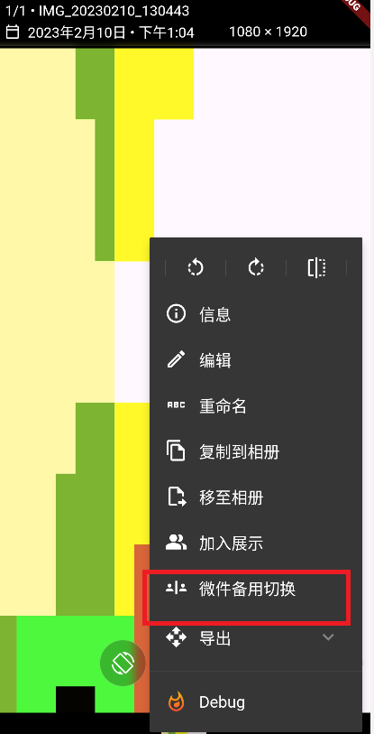

3.2.2 Click the button to switch the media set and backup media set for all widgets, as well as the update interval and backup update interval settings. Update each widget immediately once.


3.2.3 The design goal is to use one wallpaper setting when alone and another for public occasions outside to relieve wallpaper social death.

3.2.4 When there is no bug, you can directly click the desktop widget to enter the picture viewer and switch the settings. If there is a bug, please open the APP and find the widget backup switch.

3.3 Known Issues

bug1: The desktop widget may display the settings of a widget that no longer exists when the system has issues (such as widget addition failure). Reinstalling the app can resolve this issue. Not reinstalling will not affect the normal widget settings.
Normal:
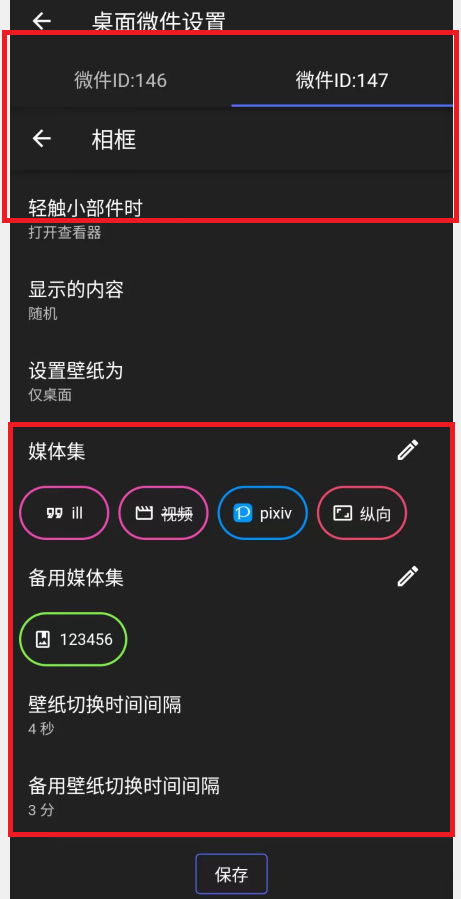
bug：
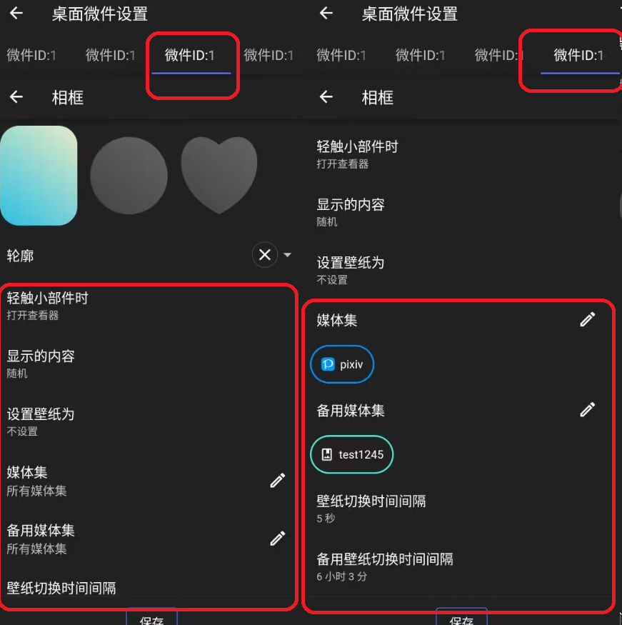

bug2: Occasionally, the desktop widget may not display images. You can force the widget to update by clicking into the widget or wait for the next automatic update.

bug3: Occasionally, the widget may stop updating. You can force the widget to update by clicking into it.

3.4 Precautions

**Please do not add too many widgets with a high update frequency, so as not to cause the phone to lag.
Do not add too many widgets that set the desktop wallpaper at the same time, so as not to cause the phone to lag.
The settings in the pictures do not represent the actual settings in use, please set them according to your personal situation.**

As of (20230213), my settings have two widgets:
1. Set desktop wallpaper, update every 1 minute.
2. Do not set desktop wallpaper, update every 10 seconds.

### 4, Small modifications to Aves
4.1 Editing function modification

I have modified the editing function in Aves.
Previously, Aves did not support editing of media files itself and only called other apps installed on the phone. This directly overwrote the original file, causing data loss.
To avoid this, I modified the editing function to automatically copy the file and edit the copy. However, when editing is canceled, the copied file will not be automatically deleted.

4.2 Cancel display all collecion

In the original Aves, cancelling label display would display all media files. I don't like this feature because I have a large number of pictures.
Therefore, I modified this feature and it can be turned on in the settings interface.


4.3 There are some other small modifications, but they will not be discussed in detail.

## How to Obtain the AC Viewer App
github:
[https://github.com/t4y-123/ac_viewer/releases/tag/publish-play](https://github.com/t4y-123/ac_viewer/releases/tag/publish-play)
OneDriver：
[https://1drv.ms/u/s!Akj4Qncyo3Oxcq1skIIq4uDa620?e=sd2mc1](https://1drv.ms/u/s!Akj4Qncyo3Oxcq1skIIq4uDa620?e=sd2mc1)

Using a computer, type in powershell in the address bar of the apk folder,enter.:
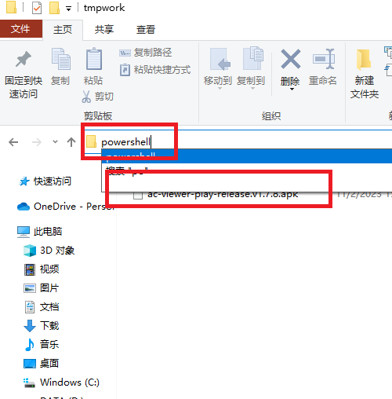


Enter the command:
>  Get-FileHash  ./*  -Algorithm MD5

Obtain the MD5 value
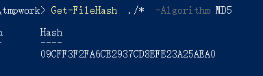

***
## Introduction to the AC Viewer
This application is a modified version of the open source application Aves on Github. I have been using the QuickViewer version 4.7.2.2421, so I named it AC(Aves Collection) Viewer and modified the icon in the style of QuickViewer. I will try to contact the Aves developer Thibault Deckers by email. If the original author integrates my modified code into the Aves project, then this application is actually no longer needed.

I have some ideas for improvement, but I don't plan to develop them yet.

For example, improvements to the display mode:

Set the album as one tag corresponding to multiple albums, and one album can appear in multiple tags to achieve multi-level album directory browsing.
For example, albums for different scenarios such as personal scenes, life scenes, work scenes, etc.
Replace "display switch and lock" with "scene switch and lock".
The app should automatically label new photos as belonging to a scene, such as photos taken in the life scene, without manual intervention, and also will not visible when switching to other scenes.
Because others have stronger abilities and can develop better functions more quickly, it may be a waste of time for both parties if I develop it.
I should read the official development documentation and other open source projects more, and then come back to modify the app. As a result, this app may not be updated and maintained in the short term.
***
## Original Aves Features

1.Media content can be searched based on conditions such as year, month, day, picture width and height, file size in KB, MB, GB, etc.
The code is as follows: \lib\model\filters\query.dart

>   static final _fieldPattern = RegExp(r'(.+)([=<>])(.+)');
 >  static final _fileSizePattern = RegExp(r'(\d+)([KMG])?');
 >  static const keyContentId = 'ID'; // 精确匹配ID，一般用不上。
 >  static const keyContentYear = 'YEAR';
 >  static const keyContentMonth = 'MONTH';
 >  static const keyContentDay = 'DAY';
 >  static const keyContentWidth = 'WIDTH';
 >  static const keyContentHeight = 'HEIGHT';
 >  static const keyContentSize = 'SIZE';
 >  static const opEqual = '=';
 >  static const opLower = '<';
 >  static const opGreater = '>';

As shown in the following figure, pictures that are greater than 2 MB and less than 4 MB, and later than 2012.
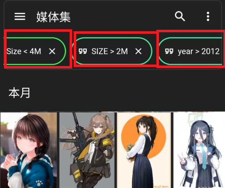


2.The grid size of the interface can be zoomed in or out by using two fingers.

3.Long pressing on the picture can select it, and long pressing and sliding the finger can select multiple pictures.

4.Map function, the Chinese version has three fewer maps than the foreign version.
This is the Aves I downloaded from the Huawei App Store in China from Github:
[https://1drv.ms/u/s!Akj4Qncyo3Oxd8rhWFRdzwXZ20I?e=3IR3bL](https://1drv.ms/u/s!Akj4Qncyo3Oxd8rhWFRdzwXZ20I?e=3IR3bL)

> C6DC9DD85D41532611D416C4B089721C

*****
#  **Oringinal Aves readme in github**

<div align="center">


## Aves

![Version badge][Version badge]
![Build badge][Build badge]

Aves is a gallery and metadata explorer app. It is built for Android, with Flutter.

[](https://play.google.com/store/apps/details?id=anonymity.ac.viewer&pcampaignid=pcampaignidMKT-Other-global-all-co-prtnr-py-PartBadge-Mar2515-1)
[](https://appgallery.huawei.com/app/C106014023)
[](https://galaxy.store/aves)
[](https://www.amazon.com/dp/B09XQHQQ72)
[](https://apt.izzysoft.de/fdroid/index/apk/anonymity.ac.viewer)
[](https://f-droid.org/packages/anonymity.ac.viewer.libre)
[](https://github.com/deckerst/aves/releases/latest)


[Compare versions](https://github.com/deckerst/aves/wiki/App-Versions)
      
<div align="left">

## Features


It scans your media collection to identify **motion photos**, **panoramas** (aka photo spheres), **360° videos**, as well as **GeoTIFF** files.

**Navigation and search** is an important part of Aves. The goal is for users to easily flow from albums to photos to tags to maps, etc.

Aves integrates with Android (from **API 19 to 33**, i.e. from KitKat to Android 13) with features such as **widgets**, **app shortcuts**, **screen saver** and **global search** handling. It also works as a **media viewer and picker**.

## Screenshots

<div align="center">

[](https://raw.githubusercontent.com/deckerst/aves_extra/main/screenshots/play/en/1.png)
[](https://raw.githubusercontent.com/deckerst/aves_extra/main/screenshots/play/en/2.png)
[](https://raw.githubusercontent.com/deckerst/aves_extra/main/screenshots/play/en/5.png)
[](https://raw.githubusercontent.com/deckerst/aves_extra/main/screenshots/play/en/3.png)
[](https://raw.githubusercontent.com/deckerst/aves_extra/main/screenshots/play/en/4.png)
[](https://raw.githubusercontent.com/deckerst/aves_extra/main/screenshots/play/en/6.png)

<div align="left">

## Changelog

The list of changes for past and future releases is available [here](https://github.com/deckerst/aves/blob/develop/CHANGELOG.md).

## Permissions

Aves requires a few permissions to do its job:
- **read contents of shared storage**: the app only accesses media files, and modifying them requires explicit access grants from the user,
- **read locations from media collection**: necessary to display the media coordinates, and to group them by country (via reverse geocoding),
- **have network access**: necessary for the map view, and most likely for precise reverse geocoding too,
- **view network connections**: checking for connection states allows Aves to gracefully degrade features that depend on internet.

## Contributing

### Issues

[Bug reports](https://github.com/deckerst/aves/issues/new?assignees=&labels=type%3Abug&template=bug_report.md&title=) and [feature requests](https://github.com/deckerst/aves/issues/new?assignees=&labels=type%3Afeature&template=feature_request.md&title=) are welcome, but read the [guidelines](https://github.com/deckerst/aves/issues/234) first. If you have questions, check out the [discussions](https://github.com/deckerst/aves/discussions).

### Code

At this stage this project does *not* accept PRs.

### Translations

Translations are powered by [Weblate](https://hosted.weblate.org/engage/aves/) and the effort of wonderfully generous volunteers.
<a href="https://hosted.weblate.org/engage/aves/">

</a>

If you want to translate this app in your language and share the result, [there is a guide](https://github.com/deckerst/aves/wiki/Contributing-to-Translations).

### Donations

****
*The original content here was sponsorship payment information.
If you would like to support the development of Aves, please go to Thibault Deckers' GitHub to make a transfer.
Although I have only made some minor repairs, I think it is somewhat inappropriate for others to transfer money from me.
I don't know him and won't receive any money if someone transfers from me.*

****

## Project Setup

Before running or building the app, update the dependencies for the desired flavor:
```
# scripts/apply_flavor_play.sh
```

To build the project, create a file named `<app dir>/android/key.properties`. It should contain a reference to a keystore for app signing, and other necessary credentials. See [key_template.properties](https://github.com/deckerst/aves/blob/develop/android/key_template.properties) for the expected keys.

To run the app:
```
# ./flutterw run -t lib/main_play.dart --flavor play
```

[Version badge]: https://img.shields.io/github/v/release/deckerst/aves?include_prereleases&sort=semver
[Build badge]: https://img.shields.io/github/actions/workflow/status/deckerst/aves/check.yml?branch=develop
=======

