AC Viewer JP

## フィーチャー
### 1. メディアの保護
1.1 誰かが気軽に見たくない写真をスワイプしてしまわないように、プレゼンテーションモードを使用することができます。

手順：

1.1.1 画像を選択


1.1.2 右上の赤いボックスをクリックしてプレゼンテーションに追加


	1.1.3 プレゼンテーションでロックする


1.1.4 この方法で、追加されたプレゼンテーション以外のコンテンツは、アルバムに表示されません。


1.1.5 デフォルトでアンロックパスワードは1234ですが、設定で変更することができます。

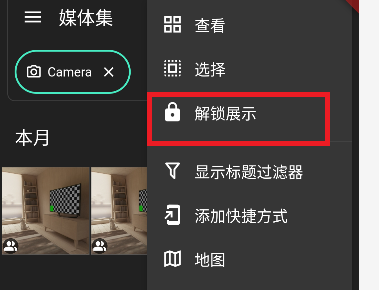


1.1.6 パスワードを忘れた場合は、ソフトウェアデータをクリアまたはアプリをアンインストールして再インストールします。


1.1.7「プレゼンテーションを検証」と「プレゼンテーションをキャンセル」は、パスワードを入力せずにロックとアンロックと同じ
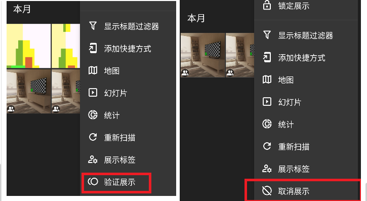

1.2 表示タグ設定

1.2.1 デフォルトでは、表示タグを追加する度に、以前のタグの表示性がクリアされ、新しいタイムスタンプタグが作成されます。

s

1.2.2 異なるタグを選択すると、異なるメディアファイルが表示されます。同じメディアファイルを複数のタグに同時に追加することもできます。

1.2.3 すべての表示をキャンセルすることは無効であり、少なくとも1つのタグが選択されなければなりません。

長押しして再順序列挙表示タグも効果がありません。

1.2.4 「管理」では、表示タグの名前を変更（左の赤いボックス）または表示タグを削除（右の赤いボックス）することができます。
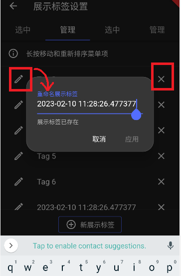

1.2.5 設定では、新しく追加されたメディアファイルを現在表示されているタグに自動的に追加するか選択することができます。
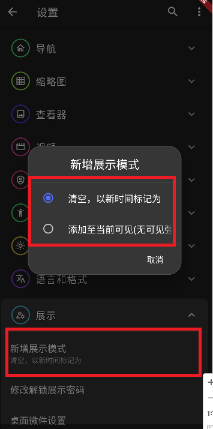

1.2.6 表示タグとメディアタグは異なります。表示タグはこのアプリ内でのみ保存され、アプリの削除で永久に削除されます。メディアタグはファイルに保存され、アプリの削除で失われません。（画像/ビデオの任意のスライドダウン）


1.2.7 バグ：メディアファイルにタグがある場合でもタグページが表示されない場合は、対応するディレクトリでカタログを再スキャンしてください。注：大量のファイルを含むディレクトリでも再スキャン後には効果がない場合があります。タグページや国ページを通常通り使用するには、アプリ「Aves」をダウンロードしてください。
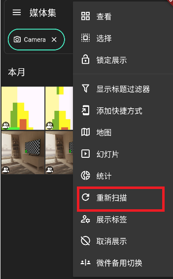

###  2. アルバムページでのプレゼンテーションモードの使用
2.1. アルバムインターフェースでディレクトリ全体を表示に追加
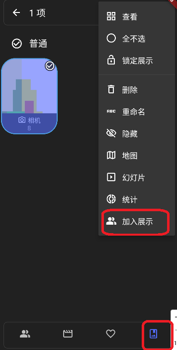

2.2. ディレクトリ名を変更


2.3. 表示を確認して、名前が変更されたフォルダが表示されていないことを確認
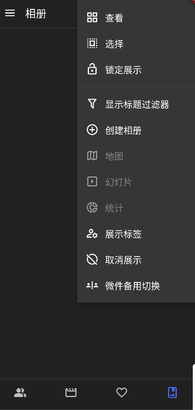

2.4. アプリを終了し、新しい写真を撮って、自動的に表示モードに表示されていることを確認
すぐに更新されない場合があり、少し時間がかかる場合があります。


2.5. 表示タグ設定で表示タグを管理
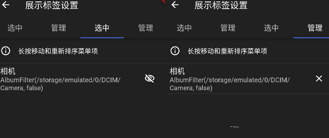
*****
**注：表示非表示はこのアプリ内でのみ有効です。他のソフトウェアを使用すると、すべてのメディアファイルが表示されます。
他の画像表示ソフトウェアにアプリロックを追加して、このソフトウェアだけを他人に写真を見せるために使用することができます。**
*****

### 　3.1 デスクトップの壁紙の設定
3.1.1 デスクトップの空白部分を長押しして「ツールを追加」を選択し、ソフトウェアツールを見つけてデスクトップにドラッグします：
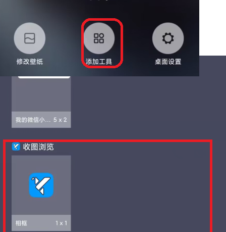

3.1.2 設定ウィンドウがポップアップします。「デスクトップのみ」に設定します（バグ：MIUIでロックスクリーンが無効です）：


3.1.4 編集アイコン（上図の最小の紅いボックス）をクリックしてアルバムに入り、画像セットを選択します：
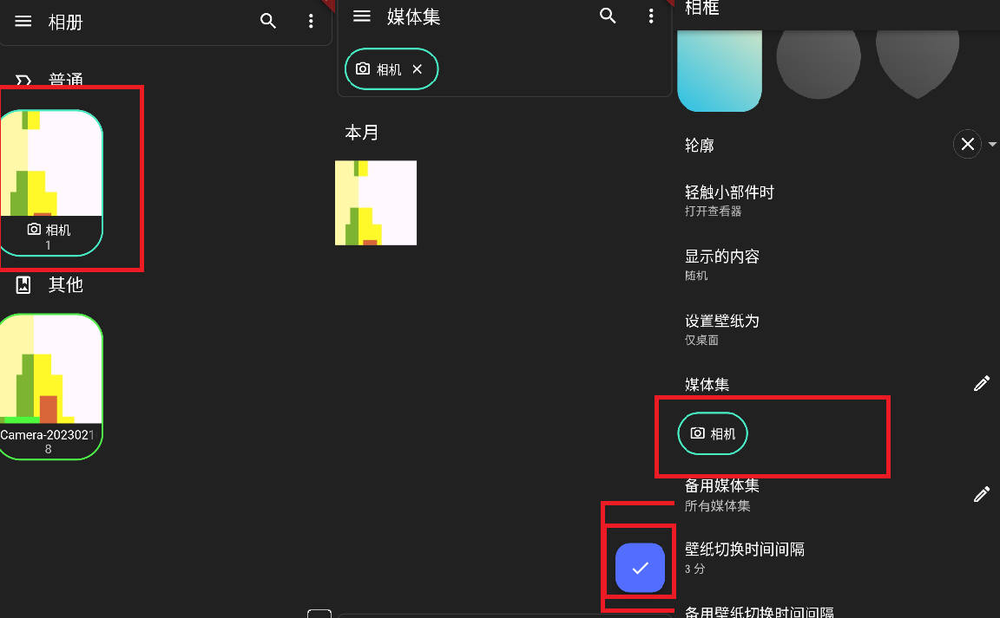

3.1.5 キーワードで検索して画像セットを設定することができます。
モバイルpixivを例にとり、その保存されたファイル名は通常「illust_」で始まります。「ill」を入力してEnterを押して確認します。
映像タグを長押しし、フィルタをクリックし、縦にクリックして最後にillフィールドを含むすべての縦画像を表示します：


3.1.6 「保存」をクリックして、デスクトップに画像ウィジェットが生成されます。長押ししてウィジェットの位置とサイズを調整します。クリックするとビューアに入り、ウィジェットを強制更新します。


3.1.7 Android のネイティブ版ではウィジェット設定を直接更新することができますが、MIUI では設定インターフェイスで設定をリセットする必要があります。


3.1.8 バックアップメディアセットについては後ほど話します。デフォルトの更新間隔は3分で、有効な設定範囲は1秒から47時間59分59秒です。

> alarmManager.setInexactRepeating(AlarmManager.ELAPSED_REALTIME, > > SystemClock.elapsedRealtime() + internal, internal.toLong(), pendingIntent)

setInexactRepeatingの更新時間は正確ではないため、3秒に設定すると、実際の待ち時間は3～15秒になる可能性があります。これは、携帯電話の実行状態によって異なります。
参照先：
[https://developer.android.com/reference/android/app/AlarmManager](https://developer.android.com/reference/android/app/AlarmManager)

3.3 既知の問題

バグ1：システムに問題が発生した場合（ウィジェットの追加に失敗したなど）、デスクトップウィジェットは存在しないウィジェットの設定を表示する可能性があります。アプリを再インストールすることでこの問題を解決できます。再インストールしない場合、設定が正常なウィジェットに影響しません。
正常：

バグ：
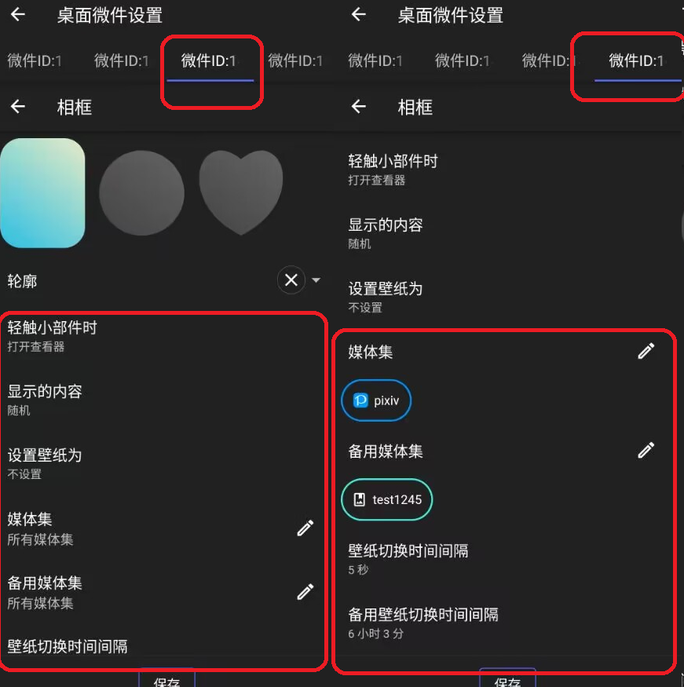

バグ2：時々、デスクトップウィジェットが画像を表示できない場合があります。ウィジェットをクリックして強制更新するか、次の自動更新まで待つことができます。

バグ3：時々、ウィジェットが更新が停止する場合があります。ウィジェットをクリックして強制更新することができます。

3.4 注意事項

**更新頻度が頻繁なウィジットを多く追加しないでください。スマートフォンが遅くなる可能性があります。
壁紙を設定するウィジットを同時に多く追加しないでください。スマートフォンが遅くなる可能性があります。
画像の設定は実際の使用状況に基づいて設定することをお勧めします。**
現在（20230213）、私の設定には2つのウィジットがあります：
1. デスクトップの壁紙を設定し、1分ごとに更新します。
2. デスクトップの壁紙を設定しない場合、10秒ごとに更新します。


### 4, Aves の若干の修正
4.1 編集機能の修正

Aves の編集機能を修正しました。
Aves 自体がメディアファイルの編集をサポートしておらず、携帯にインストールされた他のアプリケーションを呼び出すだけでした。これは直接元のファイルを上書きし、データの損失をもたらしました。
これを避けるために、編集機能を自動的にファイルをコピーしてコピーを編集するように修正しました。ただし、編集がキャンセルされた場合、コピーされたファイルは自動的に削除されません。

4.2 コレクションのすべての表示のキャンセル

元の Aves では、ラベルの表示をキャンセルするとすべてのメディアファイルが表示されました。大量の画像を持っているため、この機能は好きではありません。
そのため、この機能を修正し、設定インターフェースでオンにすることができます。


4.3 その他いくつかの小さな修正もありますが、詳細には議論しません。

## AC Viewer アプリの入手方法
github:
[https://github.com/t4y-123/ac_viewer/releases/tag/publish-play](https://github.com/t4y-123/ac_viewer/releases/tag/publish-play)
OneDriver：
[https://1drv.ms/u/s!Akj4Qncyo3Oxcq1skIIq4uDa620?e=sd2mc1](https://1drv.ms/u/s!Akj4Qncyo3Oxcq1skIIq4uDa620?e=sd2mc1)
MD5值：
`09CFF3F2FA6CE2937CD8EFE23A25AEA0`
パソコンを使って、APKフォルダのアドレスバーにpowershellと入力します,エントリー：


次のコマンドを入力します：
>  Get-FileHash  ./*  -Algorithm MD5


MD5値を取得します


## AC Viewer の紹介
このアプリケーションは、Github 上のオープンソースアプリケーション Aves の改変版です。私は QuickViewer バージョン 4.7.2.2421 を使っていたので、AC (Aves Collection) Viewer と名付け、QuickViewer のスタイルでアイコンを修正しました。私は Thibault Deckers という Aves の開発者にメールで連絡を試みます。元の作者が私が修正したコードを Aves プロジェクトに統合する場合、このアプリケーションは実際にはもう必要ありません。

改善のためのアイデアはいくつかありますが、まだ開発する予定はありません。

例えば、表示モードの改善：

アルバムを複数のアルバムに対応する1つのタグとして設定し、1つのアルバムは複数のタグに表示されるようにして、マルチレベルのアルバムディレクトリのブラウジングを実現します。
例えば、個人シーン、ライフシーン、ワークシーンなどの異なるシナリオのアルバム。
「表示切り替えとロック」を「シーン切り替えとロック」に置き換えます。
アプリは新しい写真をライフシーンなどに属するシーンに自動的にラベル付けし、他のシーンに切り替えたときには表示されないようにします。
他の人がより強い能力を持っていて、より早くより良い機能を開発できるため、私が開発することは両者にとって時間の無駄になる可能性があります。
私は公式の開発ドキュメントや他のオープンソースプロジェクトをもっと読んでから、アプリを修正することに戻ります。
その結果、このアプリは短期間アップデートやメンテナンスされない可能性があります。


*****
#  **Oringinal Aves readme in github**

<div align="center">


## Aves

![Version badge][Version badge]
![Build badge][Build badge]

Aves is a gallery and metadata explorer app. It is built for Android, with Flutter.

[](https://play.google.com/store/apps/details?id=anonymity.ac.viewer&pcampaignid=pcampaignidMKT-Other-global-all-co-prtnr-py-PartBadge-Mar2515-1)
[](https://appgallery.huawei.com/app/C106014023)
[](https://galaxy.store/aves)
[](https://www.amazon.com/dp/B09XQHQQ72)
[](https://apt.izzysoft.de/fdroid/index/apk/anonymity.ac.viewer)
[](https://f-droid.org/packages/anonymity.ac.viewer.libre)
[](https://github.com/deckerst/aves/releases/latest)


[Compare versions](https://github.com/deckerst/aves/wiki/App-Versions)
      
<div align="left">

## Features


It scans your media collection to identify **motion photos**, **panoramas** (aka photo spheres), **360° videos**, as well as **GeoTIFF** files.

**Navigation and search** is an important part of Aves. The goal is for users to easily flow from albums to photos to tags to maps, etc.

Aves integrates with Android (from **API 19 to 33**, i.e. from KitKat to Android 13) with features such as **widgets**, **app shortcuts**, **screen saver** and **global search** handling. It also works as a **media viewer and picker**.

## Screenshots

<div align="center">

[](https://raw.githubusercontent.com/deckerst/aves_extra/main/screenshots/play/en/1.png)
[](https://raw.githubusercontent.com/deckerst/aves_extra/main/screenshots/play/en/2.png)
[](https://raw.githubusercontent.com/deckerst/aves_extra/main/screenshots/play/en/5.png)
[](https://raw.githubusercontent.com/deckerst/aves_extra/main/screenshots/play/en/3.png)
[](https://raw.githubusercontent.com/deckerst/aves_extra/main/screenshots/play/en/4.png)
[](https://raw.githubusercontent.com/deckerst/aves_extra/main/screenshots/play/en/6.png)

<div align="left">

## Changelog

The list of changes for past and future releases is available [here](https://github.com/deckerst/aves/blob/develop/CHANGELOG.md).

## Permissions

Aves requires a few permissions to do its job:
- **read contents of shared storage**: the app only accesses media files, and modifying them requires explicit access grants from the user,
- **read locations from media collection**: necessary to display the media coordinates, and to group them by country (via reverse geocoding),
- **have network access**: necessary for the map view, and most likely for precise reverse geocoding too,
- **view network connections**: checking for connection states allows Aves to gracefully degrade features that depend on internet.

## Contributing

### Issues

[Bug reports](https://github.com/deckerst/aves/issues/new?assignees=&labels=type%3Abug&template=bug_report.md&title=) and [feature requests](https://github.com/deckerst/aves/issues/new?assignees=&labels=type%3Afeature&template=feature_request.md&title=) are welcome, but read the [guidelines](https://github.com/deckerst/aves/issues/234) first. If you have questions, check out the [discussions](https://github.com/deckerst/aves/discussions).

### Code

At this stage this project does *not* accept PRs.

### Translations

Translations are powered by [Weblate](https://hosted.weblate.org/engage/aves/) and the effort of wonderfully generous volunteers.
<a href="https://hosted.weblate.org/engage/aves/">

</a>

If you want to translate this app in your language and share the result, [there is a guide](https://github.com/deckerst/aves/wiki/Contributing-to-Translations).

### Donations

****
ここ元々はスポンサー支払いの情報です。
Avesの開発を支援したい場合は、Thibault DeckersのGitHubにアクセスして振込を行ってください。
私はいくつかの修正を行っただけですが、他の人から私からの振込はあまり適切ではないと思います。
私は彼を知りませんし、誰かが私から彼を振り込んでも私はお金を受け取りません。

****

## Project Setup

Before running or building the app, update the dependencies for the desired flavor:
```
# scripts/apply_flavor_play.sh
```

To build the project, create a file named `<app dir>/android/key.properties`. It should contain a reference to a keystore for app signing, and other necessary credentials. See [key_template.properties](https://github.com/deckerst/aves/blob/develop/android/key_template.properties) for the expected keys.

To run the app:
```
# ./flutterw run -t lib/main_play.dart --flavor play
```

[Version badge]: https://img.shields.io/github/v/release/deckerst/aves?include_prereleases&sort=semver
[Build badge]: https://img.shields.io/github/actions/workflow/status/deckerst/aves/check.yml?branch=develop
=======

